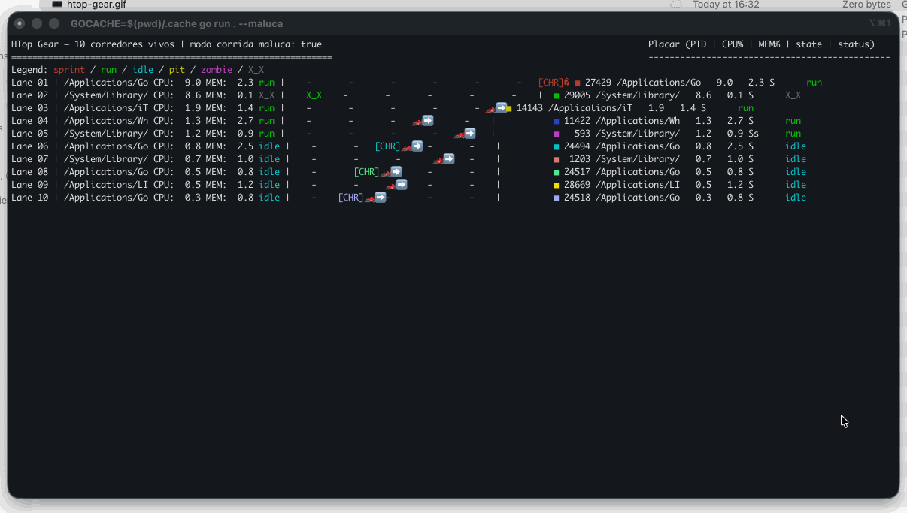

# HTop Gear 🏁

Visualizador de processos em tempo real, estilo corrida: cada PID vira um carro correndo da esquerda para a direita, com velocidade baseada no uso de CPU e “peso” na RAM. Placar lateral mostra stats ao vivo.



## Rodando

```bash
go run .
# modo corrida maluca (Chrome tanque) e emoji (default)
go run . --maluca
# forçar ASCII puro
go run . --ascii
```

> Dica: se quiser isolar cache local, use `GOCACHE=$(pwd)/.cache go run .`.

## O que você vê
- Carros/emoji correndo; sprinta quando consome CPU, fica lento quando pesado.
- Pista rolando para dar sensação de movimento e obstáculos que freiam.
- Estados especiais: zombie arrastando, pit stop (swap/W), morto (X_X).
- Placar colorido com PID, nome, CPU%, MEM% e status.
- Cores por corredor para diferenciar rapidamente.

## Controles
- `Ctrl+C` para sair (cursor volta ao normal).
